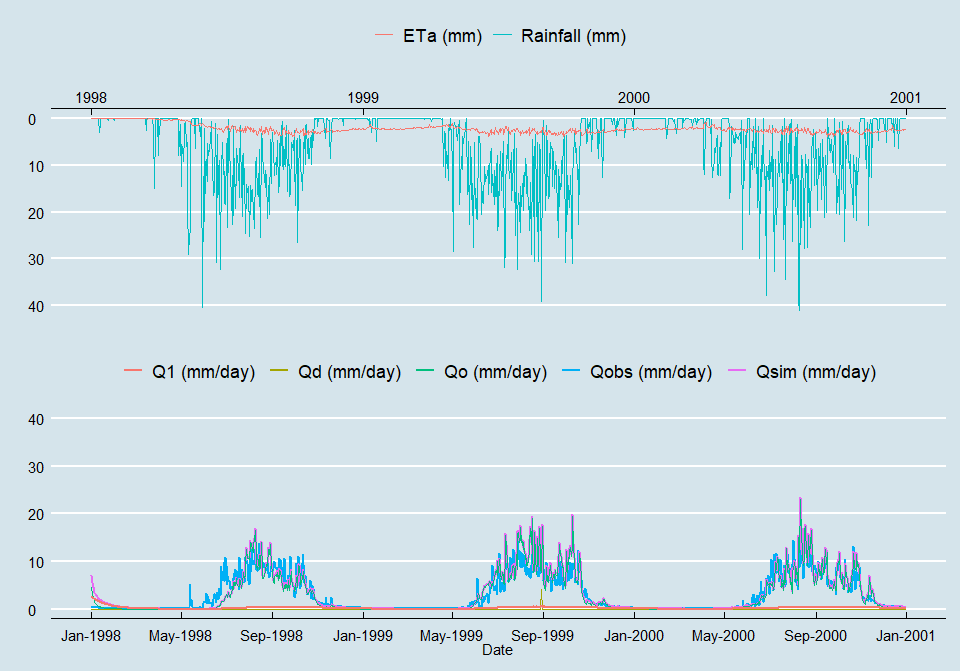
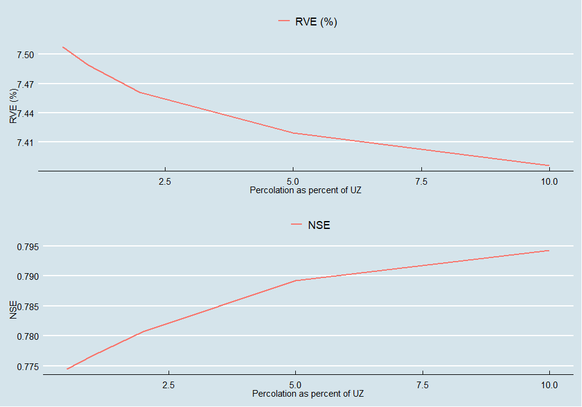
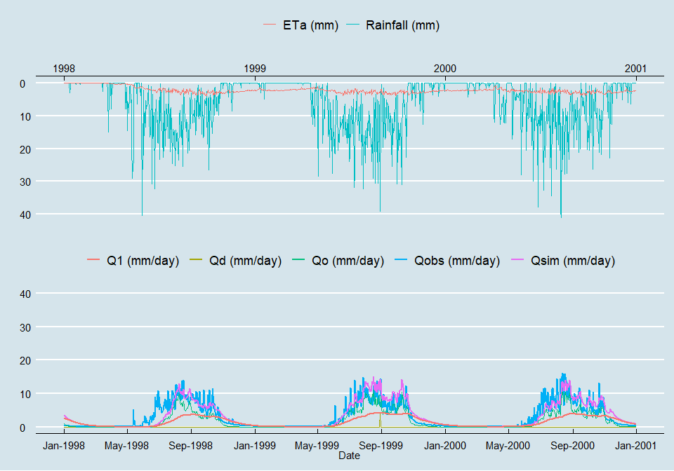
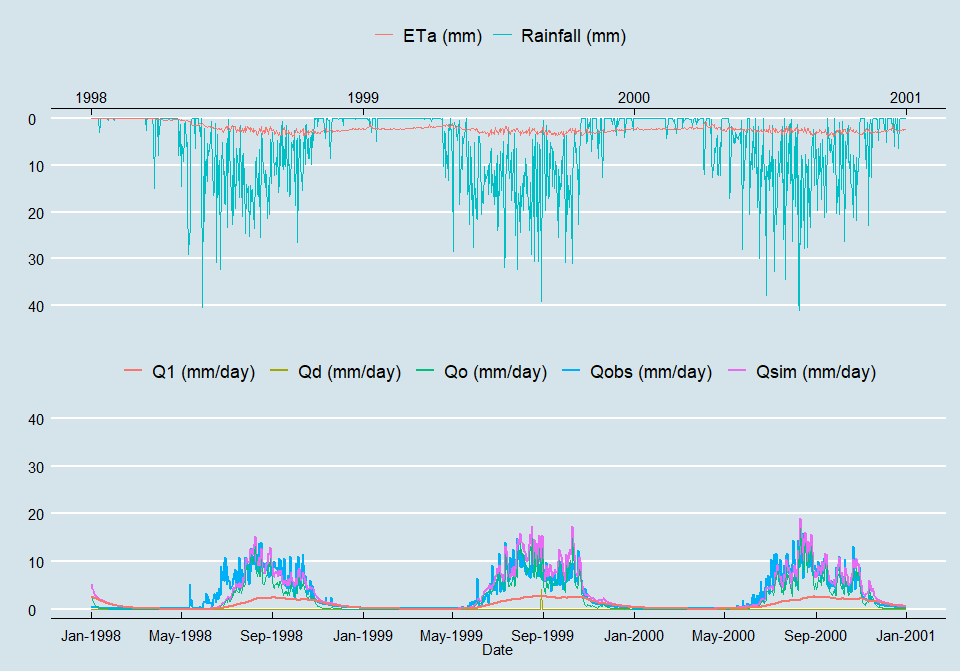
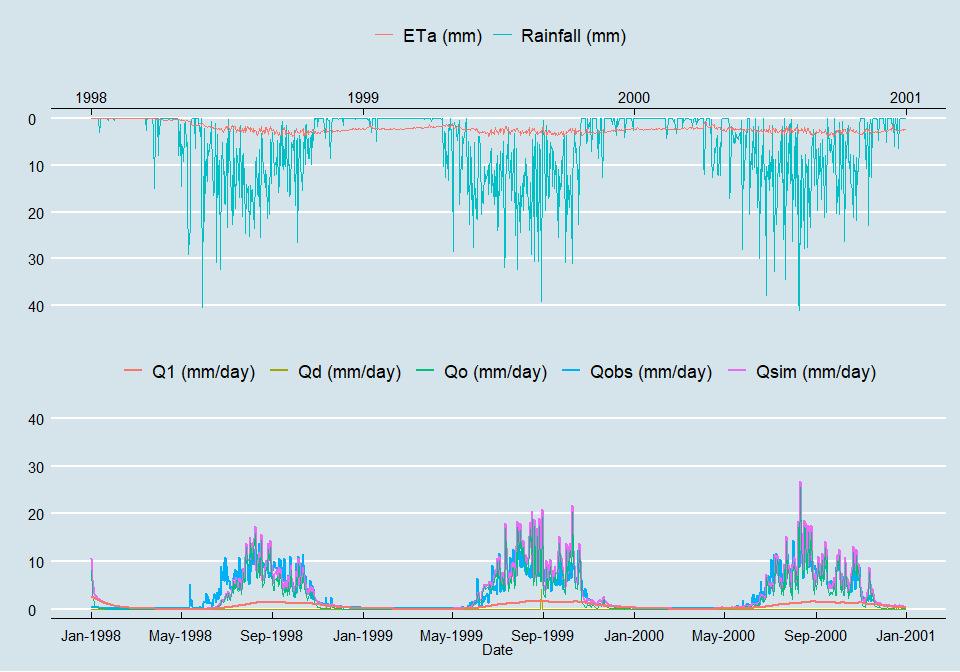
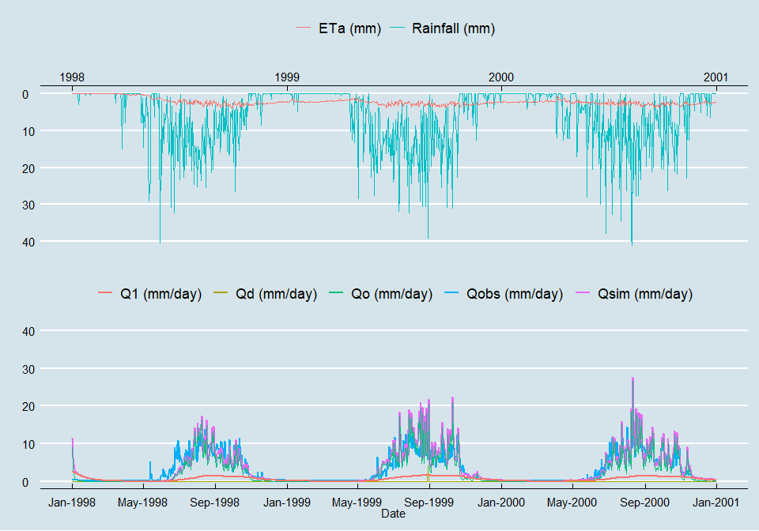
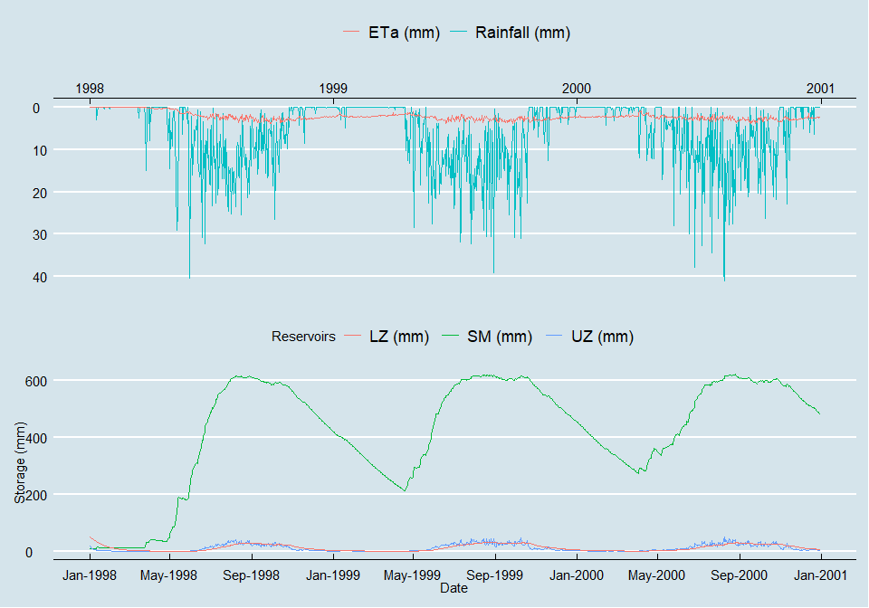
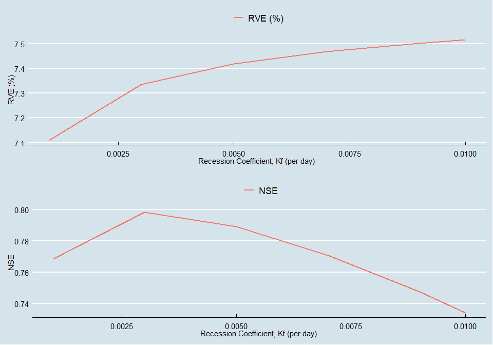

Development of HBV Water Balance Model in R
================
Surakshya Dhakal
5/31/2021

# Organize project directory

To run this RMarkdown, the project folder should have separate
sub-folders for “data”, “output”, and “script” (all in lowercase). The
“data” folder will store the raw data and the cleaned version of the
data. The “script” folder will store the RMarkdown file.The “output”
folder will have separate folders for “images” and “paper.” The “paper”
folder will store project related templates and manuscripts. The “image”
folder will store any figures generated from running the markdown.

After creating the project directory, set the working directory to the
project directory.  

# Load libraries

``` r
if(!require("pacman")) install.packages("pacman")
pacman::p_load(dplyr, tidyr, pander, ggplot2, ggthemes, cowplot, gridExtra, png)
```

# Read data

The HBV dataset in csv format is created from the original excel file
`Data set HBV Model 1950-1953_Q42019.xlsx` that was provided as part of
the assignment. Notes, formula columns, and graphs were removed from the
excel file and saved as `hbv_data.csv`. The cleaned dataset, thus, only
contains time series data on precipitation (mm/day) and potential
evapotranspiration (mm/day), which span three years from January 1, 1998
to December 31, 2000.

``` r
hbv <- read.csv("../data/hbv_data.csv")

str(hbv)   # Date is read in as character;
```

    ## 'data.frame':    1096 obs. of  4 variables:
    ##  $ Date: chr  "1/1/1998" "1/2/1998" "1/3/1998" "1/4/1998" ...
    ##  $ Qobs: num  0.32 0.31 0.28 0.28 0.28 0.28 0.27 0.26 0.26 0.26 ...
    ##  $ P   : num  0 0 0 0 0 0 0 0 0 0 ...
    ##  $ Etp : num  3.2 3.4 3.4 2.6 3.3 3.6 3.3 3.5 3.2 3.5 ...

``` r
           # Qobs (mm/day) as numeric;
           # P (precipitation (mm/day)) as numeric; and
           # Etp (potential evapotranspiration (mm/day)) as numeric.
```

``` r
# Convert Date to Date format
hbv$Date <- as.Date(hbv$Date, "%m/%d/%Y")
```

``` r
# Examine data
## Show first six observations
pander(head(hbv))
```

|    Date    | Qobs |  P  | Etp |
|:----------:|:----:|:---:|:---:|
| 1998-01-01 | 0.32 |  0  | 3.2 |
| 1998-01-02 | 0.31 |  0  | 3.4 |
| 1998-01-03 | 0.28 |  0  | 3.4 |
| 1998-01-04 | 0.28 |  0  | 2.6 |
| 1998-01-05 | 0.28 |  0  | 3.3 |
| 1998-01-06 | 0.28 |  0  | 3.6 |

``` r
# Examine data
## Summarize the data
summary(hbv)   # No missing values
```

    ##       Date                 Qobs              P               Etp      
    ##  Min.   :1998-01-01   Min.   : 0.050   Min.   : 0.000   Min.   :1.80  
    ##  1st Qu.:1998-10-01   1st Qu.: 0.140   1st Qu.: 0.000   1st Qu.:3.10  
    ##  Median :1999-07-02   Median : 0.670   Median : 1.900   Median :3.50  
    ##  Mean   :1999-07-02   Mean   : 3.033   Mean   : 5.822   Mean   :3.59  
    ##  3rd Qu.:2000-04-01   3rd Qu.: 5.810   3rd Qu.:10.000   3rd Qu.:4.10  
    ##  Max.   :2000-12-31   Max.   :16.090   Max.   :41.000   Max.   :5.70

# Object 1

**Develop a reproducible, functional HBV model that correctly accounts
for water balance.**  

To achieve this objective, functions are written in R to develop an HBV
model, and to run, plot, and analyze the model results. RMarkdown is
chosen for reproducibility of model development and simulations. Hence,
codes, outputs, as well as any changes made throughout the modelling
process are documented.  

The initial conditions and parameter values that were chosen are given
in the table below and can also be found under `Run 1`. Starting with
soil moisture reservoir, none to a small amount of direct flow (Qd) was
assumed, and hence after an examination of the mean and maximum of the
observed discharge and precipitation, a small soil moisture (SM) and a
large field capacity (FC) values were chosen. The evapotransipration
threshold was set to a maximum of 1,
 value to
simulate recharge flux to a maximum of 4, and capillary flux was set to
a small value of 0.01. With a small SM, a large FC, and a large
, the
expected recharge (Qin) was expected to be large. Similarly, for upper
zone reservoir, water content was assumed to be small though larger in
comparison to the SM,
 was
set to 1, the recession coefficient (Kf) to 0.005, and the percolation
was set to a fixed value of 0.1. With these parameter and variable
values, quick discharge (Qo) was expected to be larger than Qd but
smaller than Qin. It was expected that with relation between the SM and
UZ through Qin and Cf and the values of
 and
Kf, the discharge curve would match the curvilinear shape of the
observed discharge (Qobs), that there would also be a match with the
rising and recession limbs, how fast they climb and recess. Finally for
the lower zone reservoir, the water content was assumed to be more than
that of the upper zone. The recession coefficient, Ks, was set to 0.05,
a value larger than Kf, to allow quick recession. At this point, there
should be a parameter that controls the rising limb of the lower zone,
because with fixed percolation, with no parameter to relate upper zone,
lower zone, soil precipitation, and precipitation to each other, and no
parameter to define the curvilinear shape of the discharge, baseflow
(Q0) would be flat. That is, any changes in precipitation that would
drive changes in discharge would not be correspondingly observed for the
baseflow (Qo). In model runs following the first, changes are, thus,
introduced for percolation.

| sm  | uz  | lz  | FC  | Beta | LP  | Cflux | Alpha |  Kf   |  Ks  | Perc |
|:---:|:---:|:---:|:---:|:----:|:---:|:-----:|:-----:|:-----:|:----:|:----:|
| 10  | 30  | 50  | 650 |  4   |  1  | 0.01  |   1   | 0.005 | 0.05 | 0.1  |

## HBV model development in R

HBV model is used to simulate rainfall-runoff behavior. It is a lumped
conceptual catchment model with several routines. For the purposes of
the assignment, only rainfall is considered as precipitation with three
reservoirs - soil, upper zone, and lower zone - and correspondingly,
three routines, namely soil moisture, a quick response, and a slow
response. For each, simple equations are solved to estimate runoff,
which are summed to get predicted stream discharge.  

Figure below depicts the model structure that is used to develop an HBV
model in R. The diagram highlights the three linked compartments that
allow flow in and out, and hence, work on the principle of mass
conservation. The water balance is solved for each compartment using a
small number of parameters and variables, the values for which are
specific to water basins.  

Until **`Run 1`**, the code chunks show functions that are written to
create an HBV model, plot model results, and assess the model
performance. Following this, the functions are run using the provided
data and the initial condition mentioned above to test that the model
runs as desired.

  

The HBV model uses a number of parameters, which are:  
***FC***: Field capacity or the maximum soil moisture storage (mm)  
***Beta***: Parameter of power relationship to simulate indirect runoff
(-)  
***LP***: Limit above which evapotranspiration reaches its potential
value (-)  
***Alpha***: Measure for non-linearity of flow in quick runoff reservoir
(-)  
******:
Recession coefficient for runoff from quick runoff reservoir
()  
******:
Recession coefficient for runoff from base flow reservoir
()  
***PERC***: Constant percolation rate occurring when water is available
(mm/day)  
***CFLUX***: Maximum value for Capillary Flow (mm/day)  

The model is initialized using the following variables:  
**SM**: Soil moisture storage (mm),  
**UZ**: Upper zone storage (mm), and  
**LZ**: Lower zone storage (mm).  

### Create a function to run the model

``` r
hbv_run <- function(df, int_conds, params, perc, pct_perc){
  
  # The function uses the following arguments:
  # df: a data frame that holds the data
  # int_conds: a data frame that holds the initial conditions
  # params: a data frame that holds the model parameter values
  # perc: a numeric value for percolation
  # pct_perc: a numeric value for percent percolation
  
  
  # Create empty vectors of length equal to ...
  # ... number of observations + 1 so that the ...
  # ... first location holds the initial value. 
  SM  = rep(0, dim(df)[1]+1)
  UZ  = rep(0, dim(df)[1]+1)
  LZ  = rep(0, dim(df)[1]+1)

  Qd = rep(0, dim(df)[1]+1)
  Qin = rep(0, dim(df)[1]+1)
  Eta = rep(0, dim(df)[1]+1)
  Cf = rep(0, dim(df)[1]+1)
  Qo = rep(0, dim(df)[1]+1)
  Perc = rep(0, dim(hbv)[1]+1)
  Q1 = rep(0, dim(df)[1]+1)
  
  
  # Declare intial conditions
  SM[1] = int_conds$sm
  UZ[1] = int_conds$uz
  LZ[1] = int_conds$lz
  
  
  # Declare initial percolation
  if(perc == 0.1)
      Perc[1] = perc   # Percolation is taken as a constant
    else{
      Perc[1] = UZ[1]*pct_perc   # Percolation as a percentage of UZ
    }


  # Run the statement once for each time step
  # This updates SM, LZ, and UZ values, and ...
  # ... creates a vector of values for all variables
  for (i in 1:dim(df)[1]+1){
    # print(i)   # Starts at i = 2 and goes until i = 1097
    # break
  
    # Soil moisture routine
    Qd[i] = pmax((df$P[i-1] + SM[i-1] - params$fc), 0)
    # Fills in Qd[2], Qd[3], and so on until Qd[1097]
    # Qd[1] is already set to 0
  
    Qin[i] = ((SM[i-1]/params$fc)^params$beta) * (df$P[i-1] - Qd[i])
  
    Eta[i] = df$Etp[i-1] * pmin((SM[i-1] / (params$fc * params$lp)), 1)
  
    Cf[i] = params$cflux * ((params$fc - SM[i-1]) / params$fc)
  
    SM[i] = SM[i-1] + df$P[i-1] + Cf[i] - Eta[i] - Qin[i] - Qd[i]
    # Value of SM is updated from SM[2] onward.
    # SM[1] has the initial value that was declared.
  
  
    # Quick runoff routine
    Qo[i] = params$kf * ((UZ[i-1])^(1 + params$alpha))
  
    UZ[i] = pmax(UZ[i-1] + Qin[i] - Cf[i] - Qo[i] - Perc[i-1], 0) 
    # Value of UZ is updated from UZ[2] onward.
    # UZ[1] has the initial value that was declared.
    # As storage cannot be negative, max(x, 0) keeps the UZ value positive.
  
    if(perc == 0.1)
      Perc[i] = perc   # Percolation is taken as constant
    else{
      Perc[i] = UZ[i-1]*pct_perc   # Percolation changes in each time step as...
                                   # ... a percentage of UZ.
                                   # Chosen modification. 
    }
    
    
    # Baseflow routine
    Q1[i] = params$ks * (LZ[i-1])
    LZ[i] = LZ[i-1] + Perc[i-1] - Q1[i]

  }
  
    
  # Create a dataframe to store values for variables
  df_new <- df %>%
  mutate(
    Eta = Eta[-1],   # Since the first position for each variable was used ...  
    Qin = Qin[-1],   # ... as a filler, these are excluded from the new data frame. 
    Qd = Qd[-1],     # Doing so, the number of rows in the new data frame will ...
    Cf = Cf[-1],     # ... equal the number of rows in the original df ...
    SM = SM[-1],     # ... (in this case, 1096).
    Qo = Qo[-1],
    Perc = Perc[-1],
    UZ = UZ[-1],
    Q1 = Q1[-1],
    LZ = LZ[-1],
    Qsim = Qd + Qo + Q1)
  
  
  # Return
  return(df_new)

}
```

### Create a function to plot observed and simulated data

``` r
# Write a function to create a plot of observed and simulated data
plt_q <- function(df){
  # Add plot components

  ## Date breaks
  ## Currently not automated, but should be.
  datebreaks <- seq(as.Date("1998-01-01"), as.Date("2001-01-31"), by = "4 month")

  ## Precipitation and actual evapotranspiration
  p_eta <- ggplot(df, aes(x = Date)) +
    geom_line(aes(y = P, colour = "Rainfall (mm)")) +
    geom_line(aes(y = Eta, colour = "ETa (mm)")) +
    guides(colour=guide_legend(title="")) +
    scale_x_date(position = "top") +
    scale_y_reverse(limits = c(41, 0)) +   # Limit should change according to ...
    ylab("") +                             # ... the max value of precipitation.
    xlab("") +                             
    theme_economist()
  
  ## Observed and simulated discharges
  q_all <- ggplot(df,
    aes(x = Date)) +
    geom_line(aes(y = Qobs, colour = "Qobs (mm/day)"), size = 0.75) +
    geom_line(aes(y = Qsim, colour = "Qsim (mm/day)"), size = 0.8) +
    geom_line(aes(y = Qd, colour = "Qd (mm/day)")) +
    geom_line(aes(y = Qo, colour = "Qo (mm/day)")) +
    geom_line(aes(y = Q1, colour = "Q1 (mm/day)"), size = 0.75) +
    guides(colour = guide_legend(title="")) +
    scale_y_continuous(name = "", limits = c(0, 41)) +   # Limit should change with max(Qsim)
    scale_x_date(breaks = datebreaks, date_labels =  "%b-%Y") +
    theme_economist()

  # Put the two plots together
  # Align vertically
  plt_run <- plot_grid(p_eta, q_all, ncol=1, align="v")
  
  # Return plot
  return(plt_run)
}
```

### Create a function to plot changes in storages

``` r
# Write a function to plot changes in storage
plt_s <- function(df){
  # Add plot components

  ## Date breaks
  ## Manual input of date that should be automated
  datebreaks <- seq(as.Date("1998-01-01"), as.Date("2001-01-31"), by = "4 month")

  ## Precipitation and actual evapotranspiration
  p_eta <- ggplot(df, aes(x = Date)) +
    geom_line(aes(y = P, colour = "Rainfall (mm)")) +
    geom_line(aes(y = Eta, colour = "ETa (mm)")) +
    guides(colour=guide_legend(title="")) +
    scale_x_date(position = "top") +
    scale_y_reverse(limits = c(41, 0)) +   # Limit should change with max(P)
    ylab("") +
    xlab("") +
    theme_economist()
  
  ## SM = Soil Moisture, UZ = Upper Zone, and LZ = Lower Zone
  s_all <- ggplot(df,
    aes(x = Date)) +
    geom_line(aes(y = SM, colour = "SM (mm)")) +
    geom_line(aes(y = UZ, colour = "UZ (mm)")) +
    geom_line(aes(y = LZ, colour = "LZ (mm)")) +
    ylab("Storage (mm)") +
    guides(colour = guide_legend(title="Reservoirs")) +
    scale_x_date(breaks = datebreaks, date_labels =  "%b-%Y") +
    theme_economist()

  # Put the two plots together 
  # Align vertically
  p_eta_s_all <- plot_grid(p_eta, s_all, ncol=1, align="v")
  
  # Return plot
  return(p_eta_s_all)
}
```

## Assess model performance

The model performance can be evaluated using two objective functions,
Nash–Sutcliffe efficiency (NSE) and relative volumetric error (RVE). The
equations for these are as follows:  

^2} {\sum_{i=1}^{n} (Q_{obs, i} - \bar{Q}_{obs})^2}")

  
  

![RVE = \\Bigg\[\\frac {\\sum\_{i=1}^{n} (Q\_{sim,i} - Q\_{obs, i})} {\\sum\_{i=1}^{n} (Q\_{obs, i})}\\Bigg\] \\times 100\\%](https://latex.codecogs.com/png.latex?RVE%20%3D%20%5CBigg%5B%5Cfrac%20%7B%5Csum_%7Bi%3D1%7D%5E%7Bn%7D%20%28Q_%7Bsim%2Ci%7D%20-%20Q_%7Bobs%2C%20i%7D%29%7D%20%7B%5Csum_%7Bi%3D1%7D%5E%7Bn%7D%20%28Q_%7Bobs%2C%20i%7D%29%7D%5CBigg%5D%20%5Ctimes%20100%5C%25 "RVE = \Bigg[\frac {\sum_{i=1}^{n} (Q_{sim,i} - Q_{obs, i})} {\sum_{i=1}^{n} (Q_{obs, i})}\Bigg] \times 100\%")

where,  

is simulated streamflow, and  

is observed streamflow.  

Both NSE and RVE are dimensionless. Whereas NSE ranges from
 to
1.0, with 1.0 corresponding to a perfect fit, RVE ranges between

and ,
with 0 corresponding to the best model with no volumetric error (or,
mass balance error). Hence, according to these objective functions, a
good model is one for which NSE is maximized and RVE is minimized. More
objectively, a model with NSE between 0.6 and 0.8 is taken to be a
reasonably good performing model and with 0.8 and 0.9 as a very good
model. With respect to RVE, a model with an error between
 5% is a very
good model, whereas the one with an error between
 5% and
 10% is a
reasonably well performing model.

### Create a function to compute NSE and RVE

``` r
# Define a function to assess model performance
mod.performance <- function(qsim, qobs){
  # Calculate relative volumetric error (RVE)
  rve <- (sum(qsim - qobs) / sum(qobs)) * 100
  
  # Calculate Nash-Sutcliffe model efficiency (NSE)
  nse <- 1 - sum((qsim - qobs)^2) / sum((qobs - mean(qobs))^2)

  error_df <- data.frame(RVE = c(rve), NSE = c(nse))
  return(error_df)
}
```

## Run the HBV Model

### Run 1

Set initial conditions and parameters

``` r
# Create data frames to hold values for ...
# ... sm, uz, lz, p, beta, lp, cflux, alpha, kf, ks, and perc.
# The initial conditions are chosen after examining the given data and ...
# ... reasoning the combination of initial conditions and parameter values ...
# ... that would not give back insane values for direct, quick, and delayed flows. 
int_con <- data.frame(
                "sm" = 10, 
                "uz" = 30, 
                "lz" = 50
                )

param <- data.frame(
                "fc" = 650,
                "beta" = 4,
                "lp" = 1,
                "cflux" = 0.01,
                "alpha" = 1,
                "kf" = 0.005, 
                "ks" = 0.05
                )
```

Set percolation as a constant of 0.1

``` r
# Set percolation as a constant of 0.1
# Hence, set pct_perc to 0 or any other number for that matter.

# Create a data frame to store values of Run 1
hbv_run_1 <- hbv_run(hbv, int_con, param, 0.1, 0)

# Summarize the data
summary(hbv_run_1)
```

    ##       Date                 Qobs              P               Etp      
    ##  Min.   :1998-01-01   Min.   : 0.050   Min.   : 0.000   Min.   :1.80  
    ##  1st Qu.:1998-10-01   1st Qu.: 0.140   1st Qu.: 0.000   1st Qu.:3.10  
    ##  Median :1999-07-02   Median : 0.670   Median : 1.900   Median :3.50  
    ##  Mean   :1999-07-02   Mean   : 3.033   Mean   : 5.822   Mean   :3.59  
    ##  3rd Qu.:2000-04-01   3rd Qu.: 5.810   3rd Qu.:10.000   3rd Qu.:4.10  
    ##  Max.   :2000-12-31   Max.   :16.090   Max.   :41.000   Max.   :5.70  
    ##       Eta              Qin                Qd                 Cf           
    ##  Min.   :0.0395   Min.   : 0.0000   Min.   :0.000000   Min.   :0.0004346  
    ##  1st Qu.:1.9741   1st Qu.: 0.0000   1st Qu.:0.000000   1st Qu.:0.0008911  
    ##  Median :2.3284   Median : 0.1761   Median :0.000000   Median :0.0025595  
    ##  Mean   :2.1977   Mean   : 3.1946   Mean   :0.003715   Mean   :0.0034888  
    ##  3rd Qu.:2.7875   3rd Qu.: 5.0979   3rd Qu.:0.000000   3rd Qu.:0.0052083  
    ##  Max.   :3.8238   Max.   :31.5409   Max.   :4.071102   Max.   :0.0098523  
    ##        SM              Qo                 Perc           UZ         
    ##  Min.   :  9.6   Min.   : 0.000000   Min.   :0.1   Min.   : 0.0000  
    ##  1st Qu.:312.5   1st Qu.: 0.001164   1st Qu.:0.1   1st Qu.: 0.4824  
    ##  Median :483.6   Median : 0.418600   Median :0.1   Median : 9.1360  
    ##  Mean   :423.7   Mean   : 3.133739   Mean   :0.1   Mean   :17.3183  
    ##  3rd Qu.:592.1   3rd Qu.: 5.848726   3rd Qu.:0.1   3rd Qu.:34.2015  
    ##  Max.   :621.8   Max.   :23.573946   Max.   :0.1   Max.   :68.6643  
    ##        Q1               LZ              Qsim        
    ##  Min.   :0.1000   Min.   : 2.000   Min.   : 0.1000  
    ##  1st Qu.:0.1000   1st Qu.: 2.000   1st Qu.: 0.1116  
    ##  Median :0.1000   Median : 2.000   Median : 0.6098  
    ##  Mean   :0.1438   Mean   : 2.832   Mean   : 3.2812  
    ##  3rd Qu.:0.1000   3rd Qu.: 2.000   3rd Qu.: 5.9590  
    ##  Max.   :2.5000   Max.   :47.600   Max.   :23.6739

### Plot observed and simulated data for Run 1

``` r
# Plot and save the plot as a png image
plt_run1 <- plt_q(hbv_run_1)
ggsave(filename="../output/images/run_1.png", plot = plt_run1, width = 10, height = 8, dpi = 600)
plt_run1   # Qsim > Qobs; Baseflow is flat
```

<!-- -->

``` r
# Plot storages and save the plot as a png image
p_eta_s_all <- plt_s(hbv_run_1)
ggsave(filename="../output/images/storages_run_1.png", plot = p_eta_s_all, width = 8, height = 10, dpi = 600)

p_eta_s_all
```

<!-- -->

### Assess model performance of Run 1

``` r
# Assess model performance for run 1
pander(mod.performance(hbv_run_1$Qsim, hbv_run_1$Qobs))   # the model performs OK
```

|  RVE  |  NSE   |
|:-----:|:------:|
| 8.191 | 0.7723 |

Given the results, further examine the following two phenomena:  
1. Whether changing the percolation changes the pattern of baseflow,
and  
2. Whether changing the recession coefficient for UZ changes the
steepness of the Qsim curve to match Qobs.  

# Object 2

**Understand how making percolation (Perc) a function of the upper zone
changes baseflow (Q1)**  

To achieve this objective, Perc is modeled as a function of UZ,
specifically, as a certain percentage of UZ. For the purposes of
examination, five different percentage values are chosen. Except for
Perc, the initial conditions and parameter values are kept the same as
in Run 1.  

## Run 2.1 with percolation equal to 0.5% of UZ

``` r
# Make percolation dynamic
# Hence, set perc to 0 to forgo its use.
# Assume that 0.5% of the water in the upper zone percolates to the lower zone.
# Hence, declare pct_perc as: 
pct_perc <- (0.5/100)

# Create a new data frame to store the values of Run 2.1
hbv_run_2_1 <- hbv_run(hbv, int_con, param, 0, pct_perc)

summary(hbv_run_2_1)
```

    ##       Date                 Qobs              P               Etp      
    ##  Min.   :1998-01-01   Min.   : 0.050   Min.   : 0.000   Min.   :1.80  
    ##  1st Qu.:1998-10-01   1st Qu.: 0.140   1st Qu.: 0.000   1st Qu.:3.10  
    ##  Median :1999-07-02   Median : 0.670   Median : 1.900   Median :3.50  
    ##  Mean   :1999-07-02   Mean   : 3.033   Mean   : 5.822   Mean   :3.59  
    ##  3rd Qu.:2000-04-01   3rd Qu.: 5.810   3rd Qu.:10.000   3rd Qu.:4.10  
    ##  Max.   :2000-12-31   Max.   :16.090   Max.   :41.000   Max.   :5.70  
    ##       Eta              Qin                Qd                 Cf           
    ##  Min.   :0.0395   Min.   : 0.0000   Min.   :0.000000   Min.   :0.0004346  
    ##  1st Qu.:1.9741   1st Qu.: 0.0000   1st Qu.:0.000000   1st Qu.:0.0008911  
    ##  Median :2.3284   Median : 0.1761   Median :0.000000   Median :0.0025595  
    ##  Mean   :2.1977   Mean   : 3.1946   Mean   :0.003715   Mean   :0.0034888  
    ##  3rd Qu.:2.7875   3rd Qu.: 5.0979   3rd Qu.:0.000000   3rd Qu.:0.0052083  
    ##  Max.   :3.8238   Max.   :31.5409   Max.   :4.071102   Max.   :0.0098523  
    ##        SM              Qo                 Perc                UZ         
    ##  Min.   :  9.6   Min.   : 0.001438   Min.   :0.002682   Min.   : 0.5363  
    ##  1st Qu.:312.5   1st Qu.: 0.035273   1st Qu.:0.013280   1st Qu.: 2.6561  
    ##  Median :483.6   Median : 0.468239   Median :0.048386   Median : 9.6182  
    ##  Mean   :423.7   Mean   : 3.122114   Mean   :0.090046   Mean   :17.9880  
    ##  3rd Qu.:592.1   3rd Qu.: 5.767366   3rd Qu.:0.169814   3rd Qu.:33.9628  
    ##  Max.   :621.8   Max.   :23.391855   Max.   :0.341993   Max.   :68.3986  
    ##        Q1                 LZ                Qsim          
    ##  Min.   :0.004666   Min.   : 0.09331   Min.   : 0.006703  
    ##  1st Qu.:0.019834   1st Qu.: 0.39668   1st Qu.: 0.064360  
    ##  Median :0.081671   Median : 1.62038   Median : 0.636108  
    ##  Mean   :0.134693   Mean   : 2.64932   Mean   : 3.260522  
    ##  3rd Qu.:0.183785   3rd Qu.: 3.67169   3rd Qu.: 5.915433  
    ##  Max.   :2.500000   Max.   :47.65000   Max.   :23.572344

### Plot observed and simulated data for Run 2.1

``` r
# Plot observed and simulated data
plt_run2_1 <- plt_q(hbv_run_2_1)
ggsave(filename="../output/images/run_2_1.png", plot = plt_run2_1, width = 10, height = 8, dpi = 600)

# Baseflow changes with percipitation.
# Still Qsim >> Qobs.
plt_run2_1
```

<!-- -->

``` r
# Plot storages for Run 2.1
p_eta_s_all <- plt_s(hbv_run_2_1)
ggsave(filename="../output/images/storages_run_2_1.png", plot = p_eta_s_all, width = 8, height = 10, dpi = 600)

p_eta_s_all
```

<!-- -->

### Assess model performance of Run 2.1

``` r
# Assess model performance for run 2.1
# Improvement compared to Run 1
pander(mod.performance(hbv_run_2_1$Qsim, hbv_run_2_1$Qobs))
```

|  RVE  |  NSE   |
|:-----:|:------:|
| 7.507 | 0.7745 |

## Run 2.2 with percolation equal to 1% of UZ

``` r
# Make percolation dynamic
# Hence, set perc to 0.
# Assume that 1% of the water in the upper zone percolates to the lower zone.
# Hence, declare pct_perc as: 
pct_perc <- (1/100)

# Create a new data frame to store the values of Run 2.2
hbv_run_2_2 <- hbv_run(hbv, int_con, param, 0, pct_perc)

summary(hbv_run_2_2)
```

    ##       Date                 Qobs              P               Etp      
    ##  Min.   :1998-01-01   Min.   : 0.050   Min.   : 0.000   Min.   :1.80  
    ##  1st Qu.:1998-10-01   1st Qu.: 0.140   1st Qu.: 0.000   1st Qu.:3.10  
    ##  Median :1999-07-02   Median : 0.670   Median : 1.900   Median :3.50  
    ##  Mean   :1999-07-02   Mean   : 3.033   Mean   : 5.822   Mean   :3.59  
    ##  3rd Qu.:2000-04-01   3rd Qu.: 5.810   3rd Qu.:10.000   3rd Qu.:4.10  
    ##  Max.   :2000-12-31   Max.   :16.090   Max.   :41.000   Max.   :5.70  
    ##       Eta              Qin                Qd                 Cf           
    ##  Min.   :0.0395   Min.   : 0.0000   Min.   :0.000000   Min.   :0.0004346  
    ##  1st Qu.:1.9741   1st Qu.: 0.0000   1st Qu.:0.000000   1st Qu.:0.0008911  
    ##  Median :2.3284   Median : 0.1761   Median :0.000000   Median :0.0025595  
    ##  Mean   :2.1977   Mean   : 3.1946   Mean   :0.003715   Mean   :0.0034888  
    ##  3rd Qu.:2.7875   3rd Qu.: 5.0979   3rd Qu.:0.000000   3rd Qu.:0.0052083  
    ##  Max.   :3.8238   Max.   :31.5409   Max.   :4.071102   Max.   :0.0098523  
    ##        SM              Qo                 Perc                UZ         
    ##  Min.   :  9.6   Min.   : 0.000242   Min.   :0.002201   Min.   : 0.2201  
    ##  1st Qu.:312.5   1st Qu.: 0.024914   1st Qu.:0.022322   1st Qu.: 2.2322  
    ##  Median :483.6   Median : 0.420695   Median :0.091727   Median : 9.1259  
    ##  Mean   :423.7   Mean   : 3.036808   Mean   :0.175673   Mean   :17.5457  
    ##  3rd Qu.:592.1   3rd Qu.: 5.591173   3rd Qu.:0.334400   3rd Qu.:33.4400  
    ##  Max.   :621.8   Max.   :23.071232   Max.   :0.679282   Max.   :67.9282  
    ##        Q1                 LZ              Qsim          
    ##  Min.   :0.005102   Min.   : 0.102   Min.   : 0.005852  
    ##  1st Qu.:0.033748   1st Qu.: 0.675   1st Qu.: 0.070598  
    ##  Median :0.149268   Median : 2.974   Median : 0.660703  
    ##  Mean   :0.219439   Mean   : 4.345   Mean   : 3.259962  
    ##  3rd Qu.:0.358031   3rd Qu.: 7.159   3rd Qu.: 5.867335  
    ##  Max.   :2.500000   Max.   :47.800   Max.   :23.427345

### Plot observed and simulated data for Run 2.2

``` r
# Plot observed and simulated data
plt_run2_2 <- plt_q(hbv_run_2_2)
ggsave(filename="../output/images/run_2_2.png", plot = plt_run2_2, width = 10, height = 8, dpi = 600)

# Baseflow changes with precipitation.
# Still Qsim >> Qobs.
plt_run2_2
```

<!-- -->

``` r
# Plot storages for Run 2.2
p_eta_s_all <- plt_s(hbv_run_2_2)
ggsave(filename="../output/images/storages_run_2_2.png", plot = p_eta_s_all, width = 8, height = 10, dpi = 600)

p_eta_s_all
```

<!-- -->

### Assess model performance of Run 2.2

``` r
# Assess model performance for Run 2.2
# Slight improvement compared to Run 2.1 and perceptible improvement over Run 1.
pander(mod.performance(hbv_run_2_2$Qsim, hbv_run_2_2$Qobs))
```

|  RVE  |  NSE   |
|:-----:|:------:|
| 7.489 | 0.7767 |

## Run 2.3 with percolation equal to 2% of UZ

``` r
# Make percolation dynamic
# Hence, set perc to 0.
# Assume that 2% of the water in the upper zone percolates to the lower zone.
# Hence, declare pct_perc as: 
pct_perc <- (2/100)

# Create a new data frame to store the values of Run 2.3
hbv_run_2_3 <- hbv_run(hbv, int_con, param, 0, pct_perc)

summary(hbv_run_2_3)
```

    ##       Date                 Qobs              P               Etp      
    ##  Min.   :1998-01-01   Min.   : 0.050   Min.   : 0.000   Min.   :1.80  
    ##  1st Qu.:1998-10-01   1st Qu.: 0.140   1st Qu.: 0.000   1st Qu.:3.10  
    ##  Median :1999-07-02   Median : 0.670   Median : 1.900   Median :3.50  
    ##  Mean   :1999-07-02   Mean   : 3.033   Mean   : 5.822   Mean   :3.59  
    ##  3rd Qu.:2000-04-01   3rd Qu.: 5.810   3rd Qu.:10.000   3rd Qu.:4.10  
    ##  Max.   :2000-12-31   Max.   :16.090   Max.   :41.000   Max.   :5.70  
    ##       Eta              Qin                Qd                 Cf           
    ##  Min.   :0.0395   Min.   : 0.0000   Min.   :0.000000   Min.   :0.0004346  
    ##  1st Qu.:1.9741   1st Qu.: 0.0000   1st Qu.:0.000000   1st Qu.:0.0008911  
    ##  Median :2.3284   Median : 0.1761   Median :0.000000   Median :0.0025595  
    ##  Mean   :2.1977   Mean   : 3.1946   Mean   :0.003715   Mean   :0.0034888  
    ##  3rd Qu.:2.7875   3rd Qu.: 5.0979   3rd Qu.:0.000000   3rd Qu.:0.0052083  
    ##  Max.   :3.8238   Max.   :31.5409   Max.   :4.071102   Max.   :0.0098523  
    ##        SM              Qo                Perc               UZ        
    ##  Min.   :  9.6   Min.   : 0.00000   Min.   :0.00000   Min.   : 0.000  
    ##  1st Qu.:312.5   1st Qu.: 0.01251   1st Qu.:0.03164   1st Qu.: 1.582  
    ##  Median :483.6   Median : 0.33760   Median :0.16434   Median : 8.192  
    ##  Mean   :423.7   Mean   : 2.87731   Mean   :0.33585   Mean   :16.770  
    ##  3rd Qu.:592.1   3rd Qu.: 5.25230   3rd Qu.:0.64822   3rd Qu.:32.411  
    ##  Max.   :621.8   Max.   :22.44928   Max.   :1.34013   Max.   :67.006  
    ##        Q1                 LZ                Qsim          
    ##  Min.   :0.003753   Min.   : 0.07506   Min.   : 0.003988  
    ##  1st Qu.:0.051264   1st Qu.: 1.02527   1st Qu.: 0.079190  
    ##  Median :0.266306   Median : 5.30762   Median : 0.717517  
    ##  Mean   :0.378101   Mean   : 7.52021   Mean   : 3.259123  
    ##  3rd Qu.:0.686753   3rd Qu.:13.72585   3rd Qu.: 5.883879  
    ##  Max.   :2.500000   Max.   :48.10000   Max.   :23.142554

### Plot observed and simulated data for Run 2.3

``` r
# Plot observed and simulated data
plt_run2_3 <- plt_q(hbv_run_2_3)
ggsave(filename="../output/images/run_2_3.png", plot = plt_run2_3, width = 10, height = 8, dpi = 600)

# Baseflow changes with precipitation.
# Still Qsim >> Qobs.
plt_run2_3
```

<!-- -->

``` r
# Plot storages for Run 2.3
p_eta_s_all <- plt_s(hbv_run_2_3)
ggsave(filename="../output/images/storages_run_2_3.png", plot = p_eta_s_all, width = 8, height = 10, dpi = 600)

p_eta_s_all
```

<!-- -->

### Assess model performance of Run 2.3

``` r
# Assess model performance for run 2.3
# Improvement compared to run 1
pander(mod.performance(hbv_run_2_3$Qsim, hbv_run_2_3$Qobs))
```

|  RVE  |  NSE   |
|:-----:|:------:|
| 7.461 | 0.7807 |

## Run 2.4 with percolation equal to 5% of UZ

``` r
# Make percolation dynamic
# Hence, set perc to 0.
# Assume that 5% of the water in the upper zone percolates to the lower zone.
# Hence, declare pct_perc as: 
pct_perc <- (5/100)

# Create a new dataframe to store the values of Run 2.4
hbv_run_2_4 <- hbv_run(hbv, int_con, param, 0, pct_perc)

summary(hbv_run_2_4)
```

    ##       Date                 Qobs              P               Etp      
    ##  Min.   :1998-01-01   Min.   : 0.050   Min.   : 0.000   Min.   :1.80  
    ##  1st Qu.:1998-10-01   1st Qu.: 0.140   1st Qu.: 0.000   1st Qu.:3.10  
    ##  Median :1999-07-02   Median : 0.670   Median : 1.900   Median :3.50  
    ##  Mean   :1999-07-02   Mean   : 3.033   Mean   : 5.822   Mean   :3.59  
    ##  3rd Qu.:2000-04-01   3rd Qu.: 5.810   3rd Qu.:10.000   3rd Qu.:4.10  
    ##  Max.   :2000-12-31   Max.   :16.090   Max.   :41.000   Max.   :5.70  
    ##       Eta              Qin                Qd                 Cf           
    ##  Min.   :0.0395   Min.   : 0.0000   Min.   :0.000000   Min.   :0.0004346  
    ##  1st Qu.:1.9741   1st Qu.: 0.0000   1st Qu.:0.000000   1st Qu.:0.0008911  
    ##  Median :2.3284   Median : 0.1761   Median :0.000000   Median :0.0025595  
    ##  Mean   :2.1977   Mean   : 3.1946   Mean   :0.003715   Mean   :0.0034888  
    ##  3rd Qu.:2.7875   3rd Qu.: 5.0979   3rd Qu.:0.000000   3rd Qu.:0.0052083  
    ##  Max.   :3.8238   Max.   :31.5409   Max.   :4.071102   Max.   :0.0098523  
    ##        SM              Qo                 Perc              UZ         
    ##  Min.   :  9.6   Min.   : 0.000000   Min.   :0.0000   Min.   : 0.0000  
    ##  1st Qu.:312.5   1st Qu.: 0.002205   1st Qu.:0.0332   1st Qu.: 0.6641  
    ##  Median :483.6   Median : 0.186896   Median :0.3057   Median : 6.0819  
    ##  Mean   :423.7   Mean   : 2.464795   Mean   :0.7501   Mean   :14.9768  
    ##  3rd Qu.:592.1   3rd Qu.: 4.460014   3rd Qu.:1.4933   3rd Qu.:29.7437  
    ##  Max.   :621.8   Max.   :20.729747   Max.   :3.2195   Max.   :64.3890  
    ##        Q1                 LZ                Qsim          
    ##  Min.   :0.001909   Min.   : 0.03817   Min.   : 0.002005  
    ##  1st Qu.:0.070064   1st Qu.: 1.40128   1st Qu.: 0.085515  
    ##  Median :0.526740   Median :10.46845   Median : 0.888829  
    ##  Mean   :0.789357   Mean   :15.74904   Mean   : 3.257867  
    ##  3rd Qu.:1.560610   3rd Qu.:31.19767   3rd Qu.: 5.844836  
    ##  Max.   :2.500000   Max.   :49.00000   Max.   :22.330117

### Plot observed and simulated data for Run 2.4

``` r
# Plot observed and simulated data
plt_run2_4 <- plt_q(hbv_run_2_4)
ggsave(filename="../output/images/run_2_4.png", plot = plt_run2_4, width = 10, height = 8, dpi = 600)

# Baseflow changes with precipitation.
# Still Qsim >> Qobs.
plt_run2_4
```

<!-- -->

``` r
# Plot storages for Run 2.4
p_eta_s_all <- plt_s(hbv_run_2_4)
ggsave(filename="../output/images/storages_run_2_4.png", plot = p_eta_s_all, width = 8, height = 10, dpi = 600)

p_eta_s_all
```

<!-- -->

### Assess model performance of Run 2.4

``` r
# Assess model performance for run 2.4
# Slight improvement compared to run 2.3
pander(mod.performance(hbv_run_2_4$Qsim, hbv_run_2_4$Qobs))
```

| RVE  |  NSE   |
|:----:|:------:|
| 7.42 | 0.7892 |

## Run 2.5 with percolation equal to 10% of UZ

``` r
# Make percolation dynamic
# Hence, set perc to 0.
# Assume that 10% of the water in the upper zone percolates to the lower zone.
# Hence, declare pct_perc as: 
pct_perc <- (10/100)

# Create a new dataframe to store the values of Run 2.4
hbv_run_2_5 <- hbv_run(hbv, int_con, param, 0, pct_perc)

summary(hbv_run_2_5)
```

    ##       Date                 Qobs              P               Etp      
    ##  Min.   :1998-01-01   Min.   : 0.050   Min.   : 0.000   Min.   :1.80  
    ##  1st Qu.:1998-10-01   1st Qu.: 0.140   1st Qu.: 0.000   1st Qu.:3.10  
    ##  Median :1999-07-02   Median : 0.670   Median : 1.900   Median :3.50  
    ##  Mean   :1999-07-02   Mean   : 3.033   Mean   : 5.822   Mean   :3.59  
    ##  3rd Qu.:2000-04-01   3rd Qu.: 5.810   3rd Qu.:10.000   3rd Qu.:4.10  
    ##  Max.   :2000-12-31   Max.   :16.090   Max.   :41.000   Max.   :5.70  
    ##       Eta              Qin                Qd                 Cf           
    ##  Min.   :0.0395   Min.   : 0.0000   Min.   :0.000000   Min.   :0.0004346  
    ##  1st Qu.:1.9741   1st Qu.: 0.0000   1st Qu.:0.000000   1st Qu.:0.0008911  
    ##  Median :2.3284   Median : 0.1761   Median :0.000000   Median :0.0025595  
    ##  Mean   :2.1977   Mean   : 3.1946   Mean   :0.003715   Mean   :0.0034888  
    ##  3rd Qu.:2.7875   3rd Qu.: 5.0979   3rd Qu.:0.000000   3rd Qu.:0.0052083  
    ##  Max.   :3.8238   Max.   :31.5409   Max.   :4.071102   Max.   :0.0098523  
    ##        SM              Qo                 Perc               UZ         
    ##  Min.   :  9.6   Min.   : 0.000000   Min.   :0.00000   Min.   : 0.0000  
    ##  1st Qu.:312.5   1st Qu.: 0.000234   1st Qu.:0.02164   1st Qu.: 0.2164  
    ##  Median :483.6   Median : 0.075352   Median :0.38820   Median : 3.8537  
    ##  Mean   :423.7   Mean   : 1.934037   Mean   :1.28158   Mean   :12.7898  
    ##  3rd Qu.:592.1   3rd Qu.: 3.317469   3rd Qu.:2.57584   3rd Qu.:25.7239  
    ##  Max.   :621.8   Max.   :18.299772   Max.   :6.04976   Max.   :60.4976  
    ##        Q1                 LZ                Qsim          
    ##  Min.   :0.001482   Min.   : 0.02964   Min.   : 0.001579  
    ##  1st Qu.:0.081324   1st Qu.: 1.62649   1st Qu.: 0.089260  
    ##  Median :0.769461   Median :15.38138   Median : 1.021903  
    ##  Mean   :1.319096   Mean   :26.34698   Mean   : 3.256848  
    ##  3rd Qu.:2.688145   3rd Qu.:53.76290   3rd Qu.: 5.882153  
    ##  Max.   :3.887816   Max.   :77.75633   Max.   :21.113316

### Plot observed and simulated data for Run 2.5

``` r
# Plot observed and simulated data
plt_run2_5 <- plt_q(hbv_run_2_5)
ggsave(filename="../output/images/run_2_5.png", plot = plt_run2_5, width = 10, height = 8, dpi = 600)

# Baseflow changes with precipitation.
# Still Qsim >> Qobs.
plt_run2_5
```

<!-- -->

``` r
# Plot storages for Run 2.4
p_eta_s_all <- plt_s(hbv_run_2_5)
ggsave(filename="../output/images/storages_run_2_5.png", plot = p_eta_s_all, width = 8, height = 10, dpi = 600)

p_eta_s_all
```

<!-- -->

### Assess model performance of Run 2.5

``` r
# Assess model performance for run 2.5
# Slight improvement compared to Run 2.4
pander(mod.performance(hbv_run_2_5$Qsim, hbv_run_2_5$Qobs))
```

|  RVE  |  NSE   |
|:-----:|:------:|
| 7.386 | 0.7942 |

``` r
# Extract RVE
RVE <- c(mod.performance(hbv_run_2_1$Qsim, hbv_run_2_1$Qobs)[1],
                           mod.performance(hbv_run_2_2$Qsim, hbv_run_2_2$Qobs)[1],
                           mod.performance(hbv_run_2_3$Qsim, hbv_run_2_3$Qobs)[1],
                           mod.performance(hbv_run_2_4$Qsim, hbv_run_2_4$Qobs)[1],
                           mod.performance(hbv_run_2_5$Qsim, hbv_run_2_5$Qobs)[1]
                          )   # Returns a list

RVE <- unlist(RVE)   # Unlist


# Extract NSE
NSE <- c(mod.performance(hbv_run_2_1$Qsim, hbv_run_2_1$Qobs)[2],
                           mod.performance(hbv_run_2_2$Qsim, hbv_run_2_2$Qobs)[2],
                           mod.performance(hbv_run_2_3$Qsim, hbv_run_2_3$Qobs)[2],
                           mod.performance(hbv_run_2_4$Qsim, hbv_run_2_4$Qobs)[2],
                           mod.performance(hbv_run_2_5$Qsim, hbv_run_2_5$Qobs)[2]
                          )   # Returns a list

NSE <- unlist(NSE)   # Unlist


# Create a data frame  
df <- data.frame(Percent = c(0.5, 1, 2, 5, 10), RVE = RVE, NSE = NSE)


# Plot RVE
p_rve <- ggplot(df, aes(x = Percent)) +
    geom_line(aes(y = RVE, colour = "RVE (%)"), size = 1) +
    guides(colour=guide_legend(title="")) +
    ylab("RVE (%)") +
    xlab("Percolation as percent of UZ") +
    theme_economist()
  
# Plot NSE
p_nse <- ggplot(df, aes(x = Percent)) +
    geom_line(aes(y = NSE, colour = "NSE"), size = 1) +
    ylab("NSE") +
    xlab("Percolation as percent of UZ") +
    guides(colour = guide_legend(title="")) +
    theme_economist()

# Put the two plots together 
p_rve_nse <- plot_grid(p_rve, p_nse, ncol=1)
ggsave(filename="../output/images/run_2_errors.png", plot = p_rve_nse, width = 10, height = 8, dpi = 600)
p_rve_nse
```

<!-- -->

# Object 3

**Understand how changing recession coefficient changes quick discharge
(Qo) with percolation of 5% of UZ**  

It is understood that the recession coefficient is dependent on the
ground condition. For the purposes of the assignment, this information
is not available. Hence, several kf values can be tested to come up with
an optimized value. So, five different models are run, with values of Kf
that successively increase (Kf = {0.001, 0.003, 0.005, 0.007, 0.009,
0.01} (per day)). The Kf is tuned by keeping the initial conditions the
same as in Run 1 and 2 (all) and taking the percolation to be 5% of
UZ.  

### Run 3.1 with Kf = 0.001/day

``` r
# Make changes to Kf in the parameter set
# Keep the initial conditions the same as in Run 1 and 2 (all) except for ...
# ... Kf and make percolation dynamic

# Declare parameters
param <- data.frame(
                "fc" = 650,   # unchanged
                "beta" = 4,   # unchanged
                "lp" = 1,     # unchanged
                "cflux" = 0.01,   # unchanged
                "alpha" = 1,      # unchanged
                "kf" = 0.001,     # Changed from 0.005
                "ks" = 0.05   # unchanged
                )


# Make percolation dynamic
# Hence, set perc to 0.
# Assume that 5% of the water in the upper zone percolates to the lower zone.
# Hence, declare pct_perc as: 
pct_perc <- (5/100)
```

``` r
# Create a new data frame to store the values of Run 3.1
hbv_run_3_1 <- hbv_run(hbv, int_con, param, 0, pct_perc)

summary(hbv_run_3_1)
```

    ##       Date                 Qobs              P               Etp      
    ##  Min.   :1998-01-01   Min.   : 0.050   Min.   : 0.000   Min.   :1.80  
    ##  1st Qu.:1998-10-01   1st Qu.: 0.140   1st Qu.: 0.000   1st Qu.:3.10  
    ##  Median :1999-07-02   Median : 0.670   Median : 1.900   Median :3.50  
    ##  Mean   :1999-07-02   Mean   : 3.033   Mean   : 5.822   Mean   :3.59  
    ##  3rd Qu.:2000-04-01   3rd Qu.: 5.810   3rd Qu.:10.000   3rd Qu.:4.10  
    ##  Max.   :2000-12-31   Max.   :16.090   Max.   :41.000   Max.   :5.70  
    ##       Eta              Qin                Qd                 Cf           
    ##  Min.   :0.0395   Min.   : 0.0000   Min.   :0.000000   Min.   :0.0004346  
    ##  1st Qu.:1.9741   1st Qu.: 0.0000   1st Qu.:0.000000   1st Qu.:0.0008911  
    ##  Median :2.3284   Median : 0.1761   Median :0.000000   Median :0.0025595  
    ##  Mean   :2.1977   Mean   : 3.1946   Mean   :0.003715   Mean   :0.0034888  
    ##  3rd Qu.:2.7875   3rd Qu.: 5.0979   3rd Qu.:0.000000   3rd Qu.:0.0052083  
    ##  Max.   :3.8238   Max.   :31.5409   Max.   :4.071102   Max.   :0.0098523  
    ##        SM              Qo                 Perc               UZ          
    ##  Min.   :  9.6   Min.   : 0.000000   Min.   :0.00000   Min.   :  0.0000  
    ##  1st Qu.:312.5   1st Qu.: 0.000866   1st Qu.:0.04654   1st Qu.:  0.9307  
    ##  Median :483.6   Median : 0.118782   Median :0.54493   Median : 10.8118  
    ##  Mean   :423.7   Mean   : 1.796393   Mean   :1.41602   Mean   : 28.2984  
    ##  3rd Qu.:592.1   3rd Qu.: 3.400321   3rd Qu.:2.91561   3rd Qu.: 58.3122  
    ##  Max.   :621.8   Max.   :11.062155   Max.   :5.25884   Max.   :105.1768  
    ##        Q1                 LZ                Qsim          
    ##  Min.   :0.003064   Min.   : 0.06127   Min.   : 0.003083  
    ##  1st Qu.:0.103721   1st Qu.: 2.07442   1st Qu.: 0.114599  
    ##  Median :0.881038   Median :17.57361   Median : 1.188126  
    ##  Mean   :1.448369   Mean   :28.93610   Mean   : 3.248477  
    ##  3rd Qu.:2.905459   3rd Qu.:58.10918   3rd Qu.: 6.350643  
    ##  Max.   :4.238431   Max.   :84.76862   Max.   :15.063411

### Plot observed and simulated data for Run 3.1

``` r
# Plot observed and simulated data
plt_run3_1 <- plt_q(hbv_run_3_1)
ggsave(filename="../output/images/run_3_1.png", plot = plt_run3_1, width = 10, height = 8, dpi = 600)
plt_run3_1
```

<!-- -->

``` r
# Plot storages
p_eta_s_all <- plt_s(hbv_run_3_1)
ggsave(filename="../output/images/storages_run_3_1.png", plot = p_eta_s_all, width = 8, height = 10, dpi = 600)

p_eta_s_all
```

<!-- -->

### Assess model performance of Run 3.1

``` r
# Assess model performance for run 3.1
pander(mod.performance(hbv_run_3_1$Qsim, hbv_run_3_1$Qobs))   # RVE gets better; 
```

| RVE  |  NSE   |
|:----:|:------:|
| 7.11 | 0.7685 |

``` r
                                                              # NSE worsens (at 10th decimal place)
```

  

### Run 3.2 with Kf = 0.003/day

``` r
# Change Kf to 0.003 from 0.001
# Declare parameters
param <- data.frame(
                "fc" = 650,
                "beta" = 4,
                "lp" = 1,
                "cflux" = 0.01,
                "alpha" = 1,
                "kf" = 0.003,   # Changed from 0.001
                "ks" = 0.05
                )
```

``` r
# Create a new dataframe to store the values of Run 3.2
hbv_run_3_2 <- hbv_run(hbv, int_con, param, 0, pct_perc)

summary(hbv_run_3_2)
```

    ##       Date                 Qobs              P               Etp      
    ##  Min.   :1998-01-01   Min.   : 0.050   Min.   : 0.000   Min.   :1.80  
    ##  1st Qu.:1998-10-01   1st Qu.: 0.140   1st Qu.: 0.000   1st Qu.:3.10  
    ##  Median :1999-07-02   Median : 0.670   Median : 1.900   Median :3.50  
    ##  Mean   :1999-07-02   Mean   : 3.033   Mean   : 5.822   Mean   :3.59  
    ##  3rd Qu.:2000-04-01   3rd Qu.: 5.810   3rd Qu.:10.000   3rd Qu.:4.10  
    ##  Max.   :2000-12-31   Max.   :16.090   Max.   :41.000   Max.   :5.70  
    ##       Eta              Qin                Qd                 Cf           
    ##  Min.   :0.0395   Min.   : 0.0000   Min.   :0.000000   Min.   :0.0004346  
    ##  1st Qu.:1.9741   1st Qu.: 0.0000   1st Qu.:0.000000   1st Qu.:0.0008911  
    ##  Median :2.3284   Median : 0.1761   Median :0.000000   Median :0.0025595  
    ##  Mean   :2.1977   Mean   : 3.1946   Mean   :0.003715   Mean   :0.0034888  
    ##  3rd Qu.:2.7875   3rd Qu.: 5.0979   3rd Qu.:0.000000   3rd Qu.:0.0052083  
    ##  Max.   :3.8238   Max.   :31.5409   Max.   :4.071102   Max.   :0.0098523  
    ##        SM              Qo                 Perc               UZ         
    ##  Min.   :  9.6   Min.   : 0.000000   Min.   :0.00000   Min.   : 0.0000  
    ##  1st Qu.:312.5   1st Qu.: 0.001772   1st Qu.:0.03843   1st Qu.: 0.7687  
    ##  Median :483.6   Median : 0.168202   Median :0.37439   Median : 7.4699  
    ##  Mean   :423.7   Mean   : 2.283741   Mean   :0.93038   Mean   :18.5840  
    ##  3rd Qu.:592.1   3rd Qu.: 4.139359   3rd Qu.:1.85727   3rd Qu.:37.1455  
    ##  Max.   :621.8   Max.   :16.992773   Max.   :3.76306   Max.   :75.2613  
    ##        Q1                 LZ                Qsim          
    ##  Min.   :0.002223   Min.   : 0.04447   Min.   : 0.002281  
    ##  1st Qu.:0.081162   1st Qu.: 1.62324   1st Qu.: 0.096131  
    ##  Median :0.631122   Median :12.53195   Median : 0.947335  
    ##  Mean   :0.967869   Mean   :19.32105   Mean   : 3.255325  
    ##  3rd Qu.:1.931758   3rd Qu.:38.62639   3rd Qu.: 5.970991  
    ##  Max.   :2.698336   Max.   :53.96673   Max.   :18.970384

### Plot observed and simulated data for Run 3.2

``` r
# Plot observed and simulated data
plt_run3_2 <- plt_q(hbv_run_3_2)
ggsave(filename="../output/images/run_3_2.png", plot = plt_run3_2, width = 10, height = 8, dpi = 600)
plt_run3_2
```

<!-- -->

``` r
# Plot storages
p_eta_s_all <- plt_s(hbv_run_3_2)
ggsave(filename="../output/images/storages_run_3_2.png", plot = p_eta_s_all, width = 8, height = 10, dpi = 600)

p_eta_s_all
```

<!-- -->

### Assess model performance of Run 3.2

``` r
# Assess model performance for run 3.2
pander(mod.performance(hbv_run_3_2$Qsim, hbv_run_3_2$Qobs))   # RVE worsens (10th decimal place), 
```

|  RVE  |  NSE   |
|:-----:|:------:|
| 7.336 | 0.7983 |

``` r
                                                              # NSE improves
```

### Run 3.3 with Kf = 0.007/day

``` r
# Change Kf to 0.007 from 0.003
# Declare parameters
param <- data.frame(
                "fc" = 650,
                "beta" = 4,
                "lp" = 1,
                "cflux" = 0.01,
                "alpha" = 1,
                "kf" = 0.007,   # Changed from 0.003
                "ks" = 0.05
                )
```

``` r
# Create a new dataframe to store the values of Run 3.3
hbv_run_3_3 <- hbv_run(hbv, int_con, param, 0, pct_perc)

summary(hbv_run_3_3)
```

    ##       Date                 Qobs              P               Etp      
    ##  Min.   :1998-01-01   Min.   : 0.050   Min.   : 0.000   Min.   :1.80  
    ##  1st Qu.:1998-10-01   1st Qu.: 0.140   1st Qu.: 0.000   1st Qu.:3.10  
    ##  Median :1999-07-02   Median : 0.670   Median : 1.900   Median :3.50  
    ##  Mean   :1999-07-02   Mean   : 3.033   Mean   : 5.822   Mean   :3.59  
    ##  3rd Qu.:2000-04-01   3rd Qu.: 5.810   3rd Qu.:10.000   3rd Qu.:4.10  
    ##  Max.   :2000-12-31   Max.   :16.090   Max.   :41.000   Max.   :5.70  
    ##       Eta              Qin                Qd                 Cf           
    ##  Min.   :0.0395   Min.   : 0.0000   Min.   :0.000000   Min.   :0.0004346  
    ##  1st Qu.:1.9741   1st Qu.: 0.0000   1st Qu.:0.000000   1st Qu.:0.0008911  
    ##  Median :2.3284   Median : 0.1761   Median :0.000000   Median :0.0025595  
    ##  Mean   :2.1977   Mean   : 3.1946   Mean   :0.003715   Mean   :0.0034888  
    ##  3rd Qu.:2.7875   3rd Qu.: 5.0979   3rd Qu.:0.000000   3rd Qu.:0.0052083  
    ##  Max.   :3.8238   Max.   :31.5409   Max.   :4.071102   Max.   :0.0098523  
    ##        SM              Qo                 Perc               UZ        
    ##  Min.   :  9.6   Min.   : 0.000000   Min.   :0.00000   Min.   : 0.000  
    ##  1st Qu.:312.5   1st Qu.: 0.002545   1st Qu.:0.03015   1st Qu.: 0.603  
    ##  Median :483.6   Median : 0.204477   Median :0.27024   Median : 5.386  
    ##  Mean   :423.7   Mean   : 2.568327   Mean   :0.64699   Mean   :12.915  
    ##  3rd Qu.:592.1   3rd Qu.: 4.489272   3rd Qu.:1.26622   3rd Qu.:25.237  
    ##  Max.   :621.8   Max.   :23.416658   Max.   :2.89190   Max.   :57.838  
    ##        Q1                 LZ                Qsim          
    ##  Min.   :0.001719   Min.   : 0.03439   Min.   : 0.001854  
    ##  1st Qu.:0.064020   1st Qu.: 1.28041   1st Qu.: 0.078268  
    ##  Median :0.461361   Median : 9.20194   Median : 0.825696  
    ##  Mean   :0.687314   Mean   :13.70717   Mean   : 3.259356  
    ##  3rd Qu.:1.348530   3rd Qu.:26.95993   3rd Qu.: 5.747671  
    ##  Max.   :2.500000   Max.   :49.00000   Max.   :24.800677

### Plot observed and simulated data for Run 3.3

``` r
# Plot observed and simulated data
plt_run3_3 <- plt_q(hbv_run_3_3)
ggsave(filename="../output/images/run_3_3.png", plot = plt_run3_3, width = 10, height = 8, dpi = 600)
plt_run3_3
```

<!-- -->

``` r
# Plot storages
p_eta_s_all <- plt_s(hbv_run_3_3)
ggsave(filename="../output/images/storages_run_3_3.png", plot = p_eta_s_all, width = 8, height = 10, dpi = 600)

p_eta_s_all
```

<!-- -->

### Assess model performance of Run 3.3

``` r
# Assess model performance for run 3.3
pander(mod.performance(hbv_run_3_3$Qsim, hbv_run_3_3$Qobs))   # RVE worsens, NSE worsens
```

|  RVE  |  NSE  |
|:-----:|:-----:|
| 7.469 | 0.771 |

### Run 3.4 with Kf = 0.009/day

``` r
# Change Kf to 0.009 from 0.007
# Declare parameters
param <- data.frame(
                "fc" = 650,
                "beta" = 4,
                "lp" = 1,
                "cflux" = 0.01,
                "alpha" = 1,
                "kf" = 0.009,   # Changed from 0.001
                "ks" = 0.05
                )
```

``` r
# Create a new dataframe to store the values of Run 3.4
hbv_run_3_4 <- hbv_run(hbv, int_con, param, 0, pct_perc)

summary(hbv_run_3_4)
```

    ##       Date                 Qobs              P               Etp      
    ##  Min.   :1998-01-01   Min.   : 0.050   Min.   : 0.000   Min.   :1.80  
    ##  1st Qu.:1998-10-01   1st Qu.: 0.140   1st Qu.: 0.000   1st Qu.:3.10  
    ##  Median :1999-07-02   Median : 0.670   Median : 1.900   Median :3.50  
    ##  Mean   :1999-07-02   Mean   : 3.033   Mean   : 5.822   Mean   :3.59  
    ##  3rd Qu.:2000-04-01   3rd Qu.: 5.810   3rd Qu.:10.000   3rd Qu.:4.10  
    ##  Max.   :2000-12-31   Max.   :16.090   Max.   :41.000   Max.   :5.70  
    ##       Eta              Qin                Qd                 Cf           
    ##  Min.   :0.0395   Min.   : 0.0000   Min.   :0.000000   Min.   :0.0004346  
    ##  1st Qu.:1.9741   1st Qu.: 0.0000   1st Qu.:0.000000   1st Qu.:0.0008911  
    ##  Median :2.3284   Median : 0.1761   Median :0.000000   Median :0.0025595  
    ##  Mean   :2.1977   Mean   : 3.1946   Mean   :0.003715   Mean   :0.0034888  
    ##  3rd Qu.:2.7875   3rd Qu.: 5.0979   3rd Qu.:0.000000   3rd Qu.:0.0052083  
    ##  Max.   :3.8238   Max.   :31.5409   Max.   :4.071102   Max.   :0.0098523  
    ##        SM              Qo                 Perc               UZ         
    ##  Min.   :  9.6   Min.   : 0.000000   Min.   :0.00000   Min.   : 0.0000  
    ##  1st Qu.:312.5   1st Qu.: 0.002898   1st Qu.:0.02837   1st Qu.: 0.5674  
    ##  Median :483.6   Median : 0.209021   Median :0.24094   Median : 4.7442  
    ##  Mean   :423.7   Mean   : 2.637976   Mean   :0.57768   Mean   :11.5285  
    ##  3rd Qu.:592.1   3rd Qu.: 4.474512   3rd Qu.:1.11486   3rd Qu.:22.2654  
    ##  Max.   :621.8   Max.   :25.560662   Max.   :2.66462   Max.   :53.2923  
    ##        Q1                 LZ               Qsim          
    ##  Min.   :0.001585   Min.   : 0.0317   Min.   : 0.001756  
    ##  1st Qu.:0.059896   1st Qu.: 1.1979   1st Qu.: 0.074694  
    ##  Median :0.416072   Median : 8.2922   Median : 0.779581  
    ##  Mean   :0.618690   Mean   :12.3340   Mean   : 3.260381  
    ##  3rd Qu.:1.204749   3rd Qu.:24.0884   3rd Qu.: 5.670999  
    ##  Max.   :2.500000   Max.   :49.0000   Max.   :26.799146

### Plot observed and simulated data for Run 3.4

``` r
# Plot observed and simulated data
plt_run3_4 <- plt_q(hbv_run_3_4)
ggsave(filename="../output/images/run_3_4.png", plot = plt_run3_4, width = 10, height = 8, dpi = 600)
plt_run3_4
```

<!-- -->

``` r
# Plot storages
p_eta_s_all <- plt_s(hbv_run_3_4)
ggsave(filename="../output/images/storages_run_3_4.png", plot = p_eta_s_all, width = 8, height = 10, dpi = 600)

p_eta_s_all
```

<!-- -->

### Assess model performance of Run 3.4

``` r
# Assess model performance for run 3.4
pander(mod.performance(hbv_run_3_4$Qsim, hbv_run_3_4$Qobs))   # RVe worsens; NSE worsens
```

|  RVE  |  NSE   |
|:-----:|:------:|
| 7.503 | 0.7476 |

  

### Run 3.5 with Kf = 0.01/day

``` r
# Change Kf to 0.01 from 0.009
# Declare parameters
param <- data.frame(
                "fc" = 650,
                "beta" = 4,
                "lp" = 1,
                "cflux" = 0.01,
                "alpha" = 1,
                "kf" = 0.01,   # Changed from 0.009
                "ks" = 0.05
                )
```

``` r
# Create a new dataframe to store the values of Run 3.5
hbv_run_3_5 <- hbv_run(hbv, int_con, param, 0, pct_perc)

summary(hbv_run_3_5)
```

    ##       Date                 Qobs              P               Etp      
    ##  Min.   :1998-01-01   Min.   : 0.050   Min.   : 0.000   Min.   :1.80  
    ##  1st Qu.:1998-10-01   1st Qu.: 0.140   1st Qu.: 0.000   1st Qu.:3.10  
    ##  Median :1999-07-02   Median : 0.670   Median : 1.900   Median :3.50  
    ##  Mean   :1999-07-02   Mean   : 3.033   Mean   : 5.822   Mean   :3.59  
    ##  3rd Qu.:2000-04-01   3rd Qu.: 5.810   3rd Qu.:10.000   3rd Qu.:4.10  
    ##  Max.   :2000-12-31   Max.   :16.090   Max.   :41.000   Max.   :5.70  
    ##       Eta              Qin                Qd                 Cf           
    ##  Min.   :0.0395   Min.   : 0.0000   Min.   :0.000000   Min.   :0.0004346  
    ##  1st Qu.:1.9741   1st Qu.: 0.0000   1st Qu.:0.000000   1st Qu.:0.0008911  
    ##  Median :2.3284   Median : 0.1761   Median :0.000000   Median :0.0025595  
    ##  Mean   :2.1977   Mean   : 3.1946   Mean   :0.003715   Mean   :0.0034888  
    ##  3rd Qu.:2.7875   3rd Qu.: 5.0979   3rd Qu.:0.000000   3rd Qu.:0.0052083  
    ##  Max.   :3.8238   Max.   :31.5409   Max.   :4.071102   Max.   :0.0098523  
    ##        SM              Qo                 Perc               UZ         
    ##  Min.   :  9.6   Min.   : 0.000000   Min.   :0.00000   Min.   : 0.0000  
    ##  1st Qu.:312.5   1st Qu.: 0.002912   1st Qu.:0.02698   1st Qu.: 0.5396  
    ##  Median :483.6   Median : 0.214228   Median :0.23142   Median : 4.5351  
    ##  Mean   :423.7   Mean   : 2.665323   Mean   :0.55047   Mean   :10.9842  
    ##  3rd Qu.:592.1   3rd Qu.: 4.497191   3rd Qu.:1.06033   3rd Qu.:21.1910  
    ##  Max.   :621.8   Max.   :26.508541   Max.   :2.57432   Max.   :51.4864  
    ##        Q1                 LZ                Qsim          
    ##  Min.   :0.001531   Min.   : 0.03062   Min.   : 0.001696  
    ##  1st Qu.:0.058020   1st Qu.: 1.16040   1st Qu.: 0.072425  
    ##  Median :0.402065   Median : 7.95548   Median : 0.770638  
    ##  Mean   :0.591751   Mean   :11.79499   Mean   : 3.260789  
    ##  3rd Qu.:1.147555   3rd Qu.:22.94853   3rd Qu.: 5.634159  
    ##  Max.   :2.500000   Max.   :49.00000   Max.   :27.689917

### Plot observed and simulated data for Run 3.5

``` r
# Plot observed and simulated data
plt_run3_5 <- plt_q(hbv_run_3_5)
ggsave(filename="../output/images/run_3_5.png", plot = plt_run3_5, width = 10, height = 8, dpi = 600)
plt_run3_5
```

<!-- -->

``` r
# Plot storages
p_eta_s_all <- plt_s(hbv_run_3_5)
ggsave(filename="../output/images/storages_run_3_5.png", plot = p_eta_s_all, width = 8, height = 10, dpi = 600)

p_eta_s_all
```

<!-- -->

### Assess model performance of Run 3.5

``` r
# Assess model performance for Run 3.5
pander(mod.performance(hbv_run_3_5$Qsim, hbv_run_3_5$Qobs))   # RVE worsens; NSE worsens
```

|  RVE  |  NSE   |
|:-----:|:------:|
| 7.516 | 0.7343 |

### Plot model errors against Kf values

``` r
# Extract RVE
RVE <- c(mod.performance(hbv_run_3_1$Qsim, hbv_run_3_1$Qobs)[1],
                           mod.performance(hbv_run_3_2$Qsim, hbv_run_3_2$Qobs)[1],
                           mod.performance(hbv_run_2_4$Qsim, hbv_run_2_4$Qobs)[1],
                           mod.performance(hbv_run_3_3$Qsim, hbv_run_3_3$Qobs)[1],
                           mod.performance(hbv_run_3_4$Qsim, hbv_run_3_4$Qobs)[1],
                           mod.performance(hbv_run_3_5$Qsim, hbv_run_3_5$Qobs)[1]
                          )   # Returns a list

RVE <- unlist(RVE)   # Unlist


# Extract NSE
NSE <- c(mod.performance(hbv_run_3_1$Qsim, hbv_run_3_1$Qobs)[2],
                           mod.performance(hbv_run_3_2$Qsim, hbv_run_3_2$Qobs)[2],
                           mod.performance(hbv_run_2_4$Qsim, hbv_run_2_4$Qobs)[2],   # 5% pct_perc & Kf = 0.005 (Run 2.4)
                           mod.performance(hbv_run_3_3$Qsim, hbv_run_3_3$Qobs)[2],
                           mod.performance(hbv_run_3_4$Qsim, hbv_run_3_4$Qobs)[2],
                           mod.performance(hbv_run_3_5$Qsim, hbv_run_3_5$Qobs)[2]
                          )   # Returns a list

NSE <- unlist(NSE)   # Unlist


# Create a data frame  
df <- data.frame(Kf = c(0.001, 0.003, 0.005, 0.007, 0.009, 0.01), RVE = RVE, NSE = NSE)


# Plot RVE
p_rve <- ggplot(df, aes(x = Kf)) +
    geom_line(aes(y = RVE, colour = "RVE (%)"), size = 1) +
    guides(colour=guide_legend(title="")) +
    ylab("RVE (%)") +
    xlab("Recession Coefficient, Kf (per day)") +
    theme_economist()
  
# Plot NSE
p_nse <- ggplot(df, aes(x = Kf)) +
    geom_line(aes(y = NSE, colour = "NSE"), size = 1) +
    ylab("NSE") +
    xlab("Recession Coefficient, Kf (per day)") +
    guides(colour = guide_legend(title="")) +
    theme_economist()

# Put the two plots together 
p_rve_nse <- plot_grid(p_rve, p_nse, ncol=1)
ggsave(filename="../output/images/run_3_errors.png", plot = p_rve_nse, width = 10, height = 8, dpi = 600)
p_rve_nse
```

<!-- -->

# Conclusion

An HBV model was developed and water balance equations were solved for
the three reservoirs - SM, UZ, and LZ - using an initial condition and a
small number of parameters. After the first run, Perc and Kf were tuned
to improve the match between simulated and observed discharge
hydrographs. Optimum Perc and Kf were determined with RVE and NSE that
were estimated to assess the model performance.  

Following Run 1, where percolation was set to a fixed value of 0.1,
percolation was modified to be a function of UZ (Perc = x% of UZ). By
modifying percolation in this way, a dynamic baseflow was achieved.
According to the initial condition that was set and the RVE and NSE
values, the optimum percolation was determined to be 10% of UZ. A
limitation of this is that
 value
was not considered. UZ changes with changes in
 and
this would translate to changes in percolation. As such, it is thought
that 
parameter should have been tuned before modifying Perc.  

After modifying percolation, recession coefficient (Kf) was tuned to
improve the match between simulated and observed discharge curves,
especially at the tails for each year. The optimal Kf was found to be
0.003 (per day).  

Overall, since the system is coupled, changes in any one parameter
affects discharges from the three reservoirs. Model calibration is not
easy, as not only an informed decision has to be made, but models have
to be rerun and assessed iteratively. Even so, decisions cannot be based
solely on RVE and NSE. To reach a justifiable conclusion, the results of
each model has to be critically examined, qualitatively and
quantitatively.
